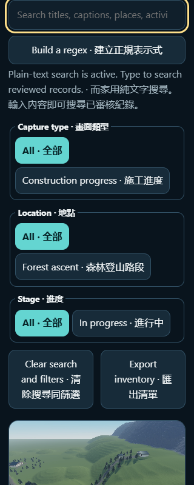

# Mountain Climbing Gallery

This public gallery holds images captured from the real Roblox experience after privacy and rights review. Construction-progress images are labeled as such and never presented as final realism or Play evidence. The public page is live, while its current browser interaction and broader page requirements remain unfinished.

## Open the gallery

Open the [public gallery](https://ding-ding-projects.github.io/mountain-climbing-roblox-gallery/). The latest verified hosted revision serves four reviewed images, as recorded in [live-publication-004](docs/evidence/live-publication-004.json). Three additional historical facility images are reviewed in the current source and await public delivery verification. Earlier receipts remain available. The page uses no remote scripts, fonts, images, analytics, or runtime services.

## Evidence policy

Each image record includes a content SHA-256, source state, viewport, capture method, privacy and rights review, and a capture time only when a validated receipt provides it. Unavailable scale, theme, or timestamp values remain explicitly unavailable. See [the evidence guide](docs/evidence/README.md).

## Current status

The Bakery pilot is applied in Studio version 99 with 1,013 parts, seven supplied doors, and 20 markers. The original 538-part interior, earlier 986-part pilot, and 4,003 supplied-original descendants remain preserved. Play started in 10.066 seconds; the runtime binder was ready in 5.520 seconds. One 6.015-second client sample measured 60.012 FPS, which is not broad performance acceptance. The pilot remains unaccepted: room clearance, individual doors, privacy, service behavior, and save/reopen remain unverified. Three historical station and rest construction views are included in the source gallery; none depicts the current Bakery pilot. Their exact capture times are unavailable except for a validated call-start time on one image, which is not presented as its capture time. See the [current progress evidence](docs/evidence/progress-version99-20260929.json). The previously verified hosted gallery still has four images until the new source revision is independently checked.

**廣東話：** Bakery 試行已套用到 Studio 版本 99，有 1,013 件部件、七道已批准嘅供應商門同 20 個標記。原有 538 件部件室內、較早嘅 986 件試行同 4,003 件供應商原件後代都已保留。Play 用咗 10.066 秒啟動，運行綁定器喺 5.520 秒後就緒。一次 6.015 秒用戶端取樣錄得 60.012 FPS，唔代表整體效能驗收。試行仍未獲驗收：房間通行、各道門、私隱、服務功能同存檔重開都仲未驗。源碼畫廊新增三張較早嘅車站同休息設施施工相，佢哋都唔係今次 Bakery 試行嘅畫面。除咗其中一張有經驗證嘅截圖呼叫開始時間之外，其他確切拍攝時間都無法確認；該呼叫時間唔會冒充成拍攝時間。詳情見[最新進度證據](docs/evidence/progress-version99-20260929.json)。新源碼版本完成獨立驗證之前，已驗證嘅公開畫廊仍然只有四張相。

The latest verified hosted manifest contains four construction images: the forest ascent, supported summit aircraft stairs, a partial daytime summit approach, and a short night-lit trailhead segment. The current source manifest contains three further historical facility views. They are original Edit-mode construction captures, not Bakery evidence or acceptance of the station and rest facilities. Their per-image reviews, unchanged bytes, captions, limitations, and unavailable capture times are recorded individually under `docs/evidence/records/` and in `docs/evidence/gallery.json`. The source inventory contains many additional captures; this update admits only records with explicit scene-only reuse review and current pixels that match that scope. Images requiring owner review, showing obsolete roof states or transition blur, or lacking current per-image public-use qualification remain withheld. The cave capture also remains withheld pending its specific complete review. See [ROADMAP.md](ROADMAP.md) and [HANDOFF.md](HANDOFF.md) for the current implementation state and evidence still needed.

## Responsive browser evidence

An earlier source revision was rebuilt and inspected in an isolated browser at a 929×1004 window and a 320×800 CSS-pixel touch viewport. The desktop capture shows the responsive toolbar after the search field and record-derived facets were repaired. The narrow capture shows the same controls stacking without horizontal overflow. The current settings and command-palette search revision has not received the same browser inspection. These images document the earlier gallery interface only; they are not evidence of additional game content.

The measured viewport sizes, resource and accessibility results, source revision, and image hashes are recorded in [the responsive layout evidence](docs/evidence/ui/responsive-layout.json). The earlier capture is retained there as before evidence.
