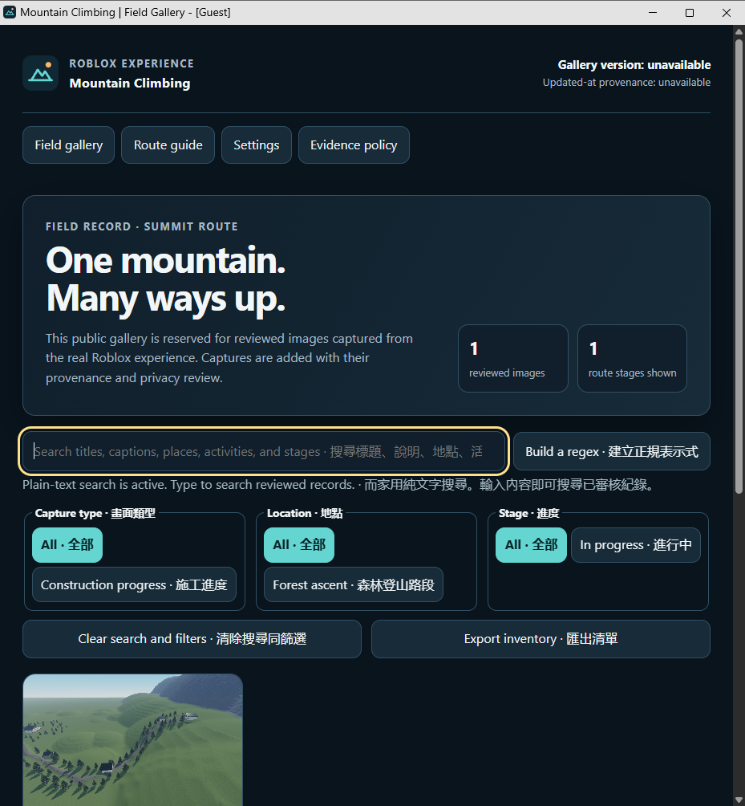

# Mountain Climbing Gallery

The gallery source contains **424 distinct reviewed original images**, totaling **118,029,333 bytes**. The complete inventory review covered **434 source files and 424 distinct byte hashes**; ten source files were exact duplicates. It retains 19 existing images and adds 405 historical observations. **All 424 originals are publicly verified at revision `43655e9a5dc66ca6731cfb965d00c405d0877c65`.** [The current HTTP receipt](docs/evidence/live-publication-424-20261005.json) records anonymous HTTP 200 delivery, matching original hashes/dimensions, and all 118,029,333 image bytes. Hosting run [37367865389](https://github.com/Ding-Ding-Projects/mountain-climbing-roblox-gallery/actions/runs/37367865389) succeeded.

**廣東話：** 相簿原始資料有 **424 張經審查嘅原圖**，合共 **118,029,333 bytes**。完整審查涵蓋 434 個來源檔案、424 個不同雜湊；十個檔案係完全相同嘅副本。舊有 19 張保留，新增 405 張歷史觀察圖。424 張原圖嘅公開 HTTP 傳送、雜湊同尺寸已逐張核對，回條對應版本 `43655e9a5dc66ca6731cfb965d00c405d0877c65`；完整瀏覽器審查仍因保留嘅測試設定檔而未完成。

Open the [public gallery](https://ding-ding-projects.github.io/mountain-climbing-roblox-gallery/). The source inventory is [gallery.json](docs/evidence/gallery.json). 3 images document the project interface; the others document Roblox scenes. Every image has an original-byte SHA-256, dimensions, direct pixel review and public-use review. The page verifies each image hash before display, using at most six concurrent requests. Exact duplicate bytes appear once. Open an original image from its provenance details to inspect its full resolution.

The first verified image appears immediately while later downloads remain pending. Later verified images arrive in batches, with checked, verified, total and unavailable counts shown in English, Cantonese or bilingual mode. Background progress retains existing card and filter nodes, current query/filter choices and focus. Images that fail admission, download or hash verification never appear. The page does not wait for the complete 118 MB inventory before showing a verified original.


The three current hotel images show an authorized test avatar with luggage in a temporary Play probe. Their source revision applies only to the tested hotel modules, not the entire visible world or avatar assets. They show observed appearance, not full service, building, persistence or production acceptance. The initial diagnostic hold later expired; the close retry and station view belong to the subsequent successful native probe. Exact capture time remains unavailable despite second-precision clock brackets.

**廣東話：** 三張酒店新圖顯示已獲准公開嘅測試角色同手提行李。來源版本只對應受測酒店模組，唔代表畫面中全部世界或者角色資產。相片只記錄外觀，唔係整棟酒店、服務、存檔或者正式安裝驗收。首輪診斷等候後來逾時；近鏡重試同站點畫面屬於之後成功嘅原生測試。時間讀數只有秒精度，所以確切拍攝時間仍然未知。

## Complete inventory and honest limits

Historical development scenes, unfinished geometry, diagnostic views and owner-authorized test avatars are retained. A historical observation is never promoted to final realism or gameplay acceptance. Capture mode is Edit or Play only when supported by pixels or independent provenance; otherwise it is Unknown. Unknown source revisions, acquisition routes, timestamps and display scale remain explicitly unavailable. Filenames, file timestamps, preservation revisions and camera preparation times are not capture provenance.

All 424 distinct originals in this reviewed inventory are now admitted, with no pending exclusions. The owner specifically approved the one [full Studio/account-interface original](docs/evidence/records/interface-7a981df7297812f6045b.json) after its visible account and collaborator controls were disclosed. That approval applies only to this exact original, not any other or future account-interface capture. The private review retains the complete source mapping; machine paths, raw model/source files and credentials are not copied into this public repository. The reviewed owner-report views are historical observations with unknown provenance. See [the evidence policy](docs/evidence/README.md) and [historical admission](docs/features/historical-observations.md).

## Verification

- `node tests/observation-admission.mjs`: 21 cases cover original-byte copying, duplicate rejection, malformed or extra fields, unavailable metadata and negative admission boundaries.
- `node tests/background-admission.mjs docs/evidence/images/hotel-reception-edit205-001.png`: 10 cases preserve the existing strict background construction route.
- `node tests/gallery-inventory.mjs`: every current image is admitted by the actual browser source function, with matching original hash and unique bytes; every historical record has deliberate missing-review and invented-time rejection cases.
- `node tests/progressive-verification.mjs`: 14 focused asynchronous/source-DOM cases verify first-success display while a later request is pending, failed-image exclusion, six-request bounds, batched completion, truthful counts and retained card/filter/focus state. These are source tests, not current browser captures.

These source checks are separate from [current bounded live-browser observations](docs/evidence/ui/live-424-observations-20261005.json). The 1440×1000 desktop and 390×844 emulated-touch views each showed 424 verified records, loaded the final original, and passed the recorded search/filter, keyboard/focus, resource and overflow observations. Strict audit completion remains unavailable because automatic approval review rejected guest-profile removal and the profile was retained. Six genuine raw browser captures remain private pending their stronger promotion receipt. Earlier [responsive browser evidence](docs/evidence/ui/responsive-layout.json) and [sixteen-image HTTP receipt](docs/evidence/live-publication-010.json) retain their original scope. Broader page contracts remain recorded in [the feature inventory](docs/feature-inventory.json), [ROADMAP.md](ROADMAP.md) and [HANDOFF.md](HANDOFF.md).



The interface image above belongs to an earlier source revision. It does not prove the current expanded inventory rendered or that every present control works.

## Build the static export

On Windows 10/11 with its built-in PowerShell 5.1 component:

```powershell
.uild.bat /s
```

The exact root entrypoint exports the declared `docs/` tree to ignored `dist/gallery`, validates all 424 original hashes and reads back every exported file. It records `dist/gallery-build.json` with source/manifest hashes. No compiler, SDK, package manager, runtime download, administrator action or host restart is needed. When `.git` exists, Git CLI and a clean tracked source are mandatory; an unavailable Git does not silently turn a checkout into an archive. A genuine source archive has null revision and explicitly unverified history, with content-bound copy/hash proof only. Current-host success is not fresh-host verification.

`/s`, `--silent` and `SILENT=1` disable every prompt. Explicit `/run`, `--run` or `RUN_AFTER_BUILD=1` opens a task-owned loopback HTTP preview of the verified export; silent mode launches only when that run choice is explicit. The preview expires after 30 minutes and is not public hosting. Ordinary interactive build asks about preview only after export verification. Existing unowned output is retained and stops replacement; prior owned output is preserved under a unique `dist/gallery-retained-*` path. No build output or local preview state is committed.

```powershell
.uild.bat --run
.uild-installer.bat /s
```

The installer entrypoint returns **exit 2, NOT_APPLICABLE**: this static website has no installed application or genuine Squirrel payload. It creates no installer and does not claim a static folder is one. Unsupported arguments return 64, unavailable operating-system runtime returns 3, and real build failures return 1. Both wrappers propagate the real child exit result. Neither entrypoint publishes or changes hosting workflows.

The scripts have been added; execution through the exact root entrypoint is pending the clean candidate checkpoint. See [static-export documentation](docs/features/static-export.md) for boundaries and the current run verdict.
